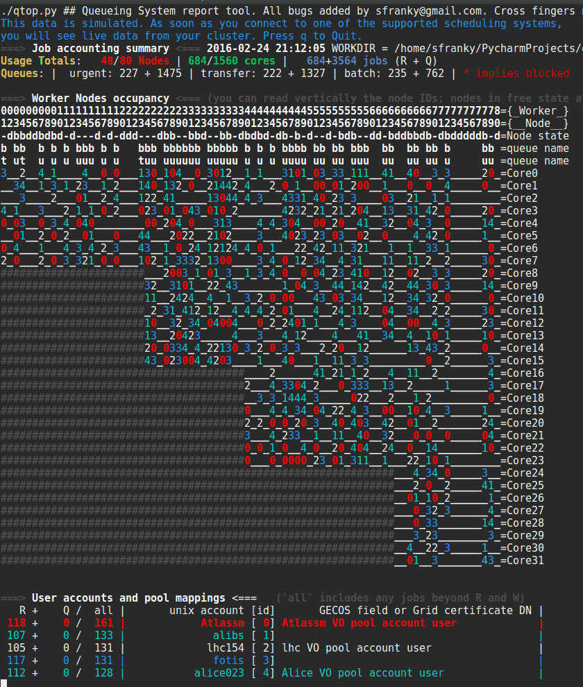

# qtop.py [](https://travis-ci.org/qtop/qtop) 

Python port by Sotiris Fragkiskos / Original bash version by Fotis Georgatos

## Summary



qtop.py is the python rewrite of qtop, a tool to monitor Torque, PBS, OAR or SGE clusters, etc.
This release provides for the *anonymization* feature, which is handy for debugging it without data leaks.
qtop is and will remain a work-in-progress project; it is intended to be built upon and extended.

This is an initial release of the source code, and work continues to make it better. 
We hope to build an active open source community that drives the future of this tool, 
both by providing feedback and by actively contributing to the source code.

This program is currently in development mode, with experimental features. If it works, peace :)


## Usage
To try qtop, you just have to do:

```
git clone https://github.com/qtop/qtop.git
cd qtop
./qtop.py 
```

To run a demo, just run
```
./qtop.py -b demo -Tw
```

Try ```--help``` for all available options.

## Documentation

Documentation/tutorial [here](docs/documentation.md).

## Profile

```
Description: The command-line tool to tame queueing or scheduling systems and some more
License: MIT/GPL
Version: 0.8.9 / Date: April 3, 2016
Homepage: https://github.com/qtop/qtop
```
